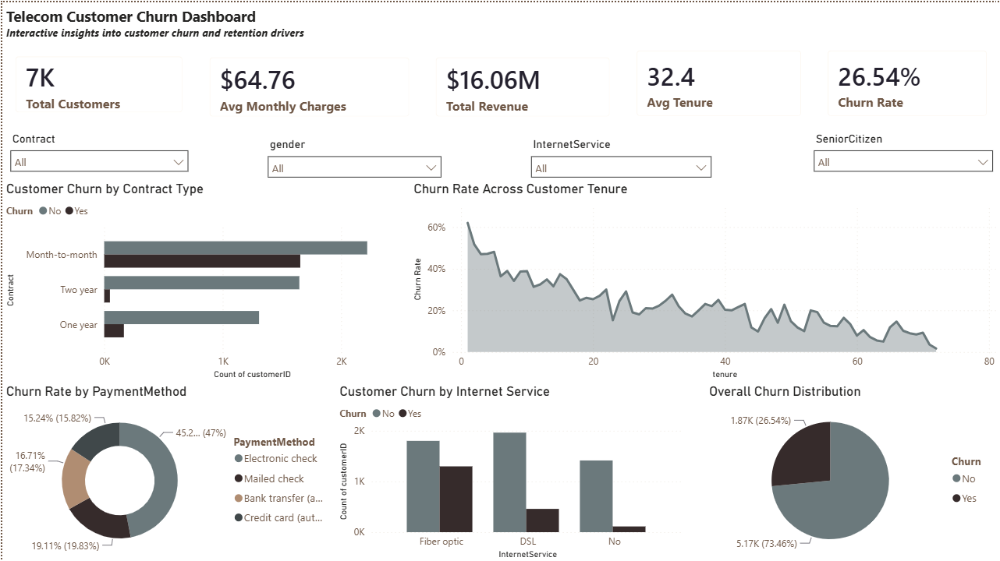

# 📊 Telecom Customer Churn Analysis and Prediction

An end-to-end Data Analytics and Machine Learning project that analyzes customer churn behavior in a telecom company and predicts whether a customer is likely to churn. The project combines data analysis, feature engineering, machine learning, explainable AI (SHAP), and an interactive Power BI dashboard to generate actionable business insights.

---

## 🎯 Project Objective

The primary goal of this project is to:

- Analyze factors influencing customer churn.
- Build a machine learning model to predict churn.
- Generate business insights to improve customer retention.
- Present findings through an interactive Power BI dashboard.

---

## 📂 Dataset

- **Source:** IBM Telco Customer Churn Dataset
- **Records:** 7,043 Customers
- **Target Variable:** Churn (Yes / No)

---

## 🛠️ Tech Stack

- Python
- Pandas
- NumPy
- Matplotlib
- Seaborn
- Scikit-Learn
- XGBoost
- SHAP
- Streamlit
- Power BI

---

## 📈 Project Workflow

1. Data Understanding
2. Data Cleaning & Preprocessing
3. Exploratory Data Analysis (EDA)
4. Feature Engineering
5. Model Building
6. Hyperparameter Tuning
7. Model Evaluation
8. Model Explainability (SHAP)
9. Power BI Dashboard
10. Streamlit Prototype

---

## 🔍 Feature Engineering

Some important engineered features include:

- Additional Service Count
- One-Hot Encoding
- Missing Value Handling
- Feature Scaling (where required)

---

## 🤖 Machine Learning Models

Models experimented with:

- Logistic Regression
- Decision Tree
- Random Forest
- XGBoost

Final model selected:

**Random Forest Classifier**

Reason:
- Better balance between Recall and Accuracy
- Stable Cross Validation Performance
- Good Generalization

---

## 📊 Model Performance

**Random Forest**

- Accuracy: **78.8%**
- Cross Validation Score: **84.05%**
- Evaluation Metrics:
  - Accuracy
  - Precision
  - Recall
  - F1 Score
  - Confusion Matrix

---

## 💡 Key Business Insights

- Customers with **Month-to-Month contracts** have the highest churn.
- Customers with **lower tenure** are more likely to leave.
- **Fiber Optic** customers exhibit higher churn compared to DSL users.
- **Electronic Check** payment method shows comparatively higher churn.
- Contract type and tenure were among the strongest predictors of customer churn.

---

## 📊 Power BI Dashboard

The dashboard provides:

- Customer Overview
- Churn Rate KPI
- Revenue Metrics
- Churn by Contract
- Churn by Internet Service
- Churn by Payment Method
- Churn Trend Across Customer Tenure

> Dashboard Preview



---

## 📁 Project Structure

```
Telecom-Customer-Churn-Analysis-and-Prediction
│
├── app
├── dashboard
├── datasets
├── images
├── notebooks
├── README.md
└── requirements.txt
```

---

## 🚀 Future Improvements

- Deploy a production-ready Streamlit application using a preprocessing pipeline.
- Experiment with advanced ensemble models.
- Improve model recall using advanced feature engineering.
- Integrate real-time prediction capabilities.

---

## 👨‍💻 Author

**Ankush Kumar Singh**

GitHub: https://github.com/ankush-kumar-singh